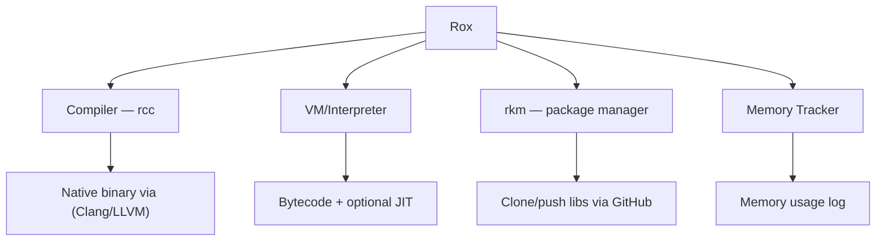

# RoxLang
A high level programming language with full control and customizability 
> note this is still a design check the [wiki](https://github.com/AhmedShah29/RoxLang/wiki) for the last updates.
### simple flowchart

